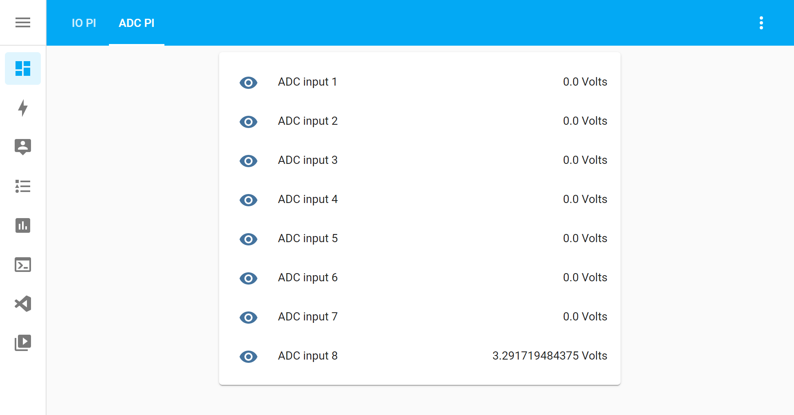

# Readme AB Electronics UK ADC Pi

[![Project Maintenance][maintenance-shield]][user_profile]

[![Community Forum][forum-shield]](https://www.abelectronics.co.uk/forums/)

This custom component is designed to run the [ADC Pi](https://www.abelectronics.co.uk/p/69/adc-pi-raspberry-pi-analogue-to-digital-converter) Raspberry Pi expansion boards from AB Electronics UK
 with Home Assistant smart home software from https://www.home-assistant.io/ on a Raspberry Pi computer.

The ADC Pi is an 8 channel 17 bit analogue to digital converter designed to work with the Raspberry Pi. The ADC Pi is based on two Microchip MCP3424 A/D converters each containing 4 analogue inputs. This library uses our own ADC Pi Python library from https://www.abelectronics.co.uk/kb/article/23/python-library-and-demos


This component will add a `sensor` with eight input voltages returned as attributes.

## Requirements

This component requires the I2C bus on the Raspberry Pi to be enabled.

If you are using the Home Assistant Operating System you can’t use existing methods to enable the I2C bus on a Raspberry Pi, you will have to enable the I2C interface manually. Please follow the instruction on https://www.home-assistant.io/common-tasks/os#enable-i2c to enable I2C on your Home Assistant Operating System installation.

## Installation

1. Using your tool of choice, open the directory (folder) for your HA configuration (where you find `configuration.yaml`).
2. If you do not have a `custom_components` directory (folder) there, you need to create it.
3. In the `custom_components` directory (folder) create a new folder called `abelectronicsadcpi`.
4. Download _all_ the files from the `custom_components/abelectronicsadcpi/` directory (folder) in this repository.
5. Place the files you downloaded in the new directory (folder) you created.
6. Restart Home Assistant

Using your HA configuration directory (folder) as a starting point you should now also have this:

```text
custom_components/abelectronicsadcpi/__init__.py
custom_components/abelectronicsadcpi/sensor.py
custom_components/abelectronicsadcpi/ADCPI.py
custom_components/abelectronicsadcpi/manifest.json
```
## Example configuration.yaml

```yaml
sensor:
  - platform: abelectronicsadcpi
    name: ADCPi
    i2c_address: 0x68
    i2c_address2: 0x69
    pga: 1
    bitrate: 18
    scan_interval: 5
   
```
# Usage

## Sensor Configuration Variables

The sensor component uses the following variables to configure the ADC sensor

Key | Type | Required | Description
-- | -- | -- | --
`i2c_address` | `Hex` | `True` | This contains the I2C address of the ADC Pi device. The default I2C addresses on the ADC Pi are 0x68 and 0x69. This address selects inputs 1 to 4.
`i2c_address2` | `Hex` | `True` | This contains the I2C address of the ADC Pi device. The default I2C addresses on the ADC Pi are 0x68 and 0x69. This address selects inputs 5 to 8.
`pga` | `Integer` | `True` | Set the gain of the PGA on the chip. 1, 2, 4 or 8.
`bitrate` | `Integer` | `True` | This contains the selected bitrate for samples, this can be 12, 14, 16 or 18. Sample speeds for selected bit rate: 12 = 12 bit (240SPS max) 14 = 14 bit (60SPS max) 16 = 16 bit (15SPS max) 18 = 18 bit (3.75SPS max).
`scan_interval` | `Integer` | `True` | This contains the scan interval in seconds between reading the device in seconds.


## Editing the configuration.yaml file to add the binary sensor 

1. Using the text editor of choice open the `configuration.yaml` for your HA configuration.
2. Add a new `sensor` with the following code: 
   ```yaml
    sensor:
      - platform: abelectronicsadcpi
    ```
3.  Add the following attributes to setup the component:
    ```yaml
    name: ADCPi
    i2c_address: 0x68
    i2c_address2: 0x69
    pga: 1
    bitrate: 18
    scan_interval: 5
    ```
3.  Add the template sensor for the component to access the attributes:
    ```yaml  
    - platform: template
      sensors:
        adcinput1:
          value_template: "{{states.sensor.adcpi.attributes.input1}}"
          friendly_name: "ADC input 1"
          unit_of_measurement: "Volts"
        adcinput2:
          value_template: "{{states.sensor.adcpi.attributes.input2}}"
          friendly_name: "ADC input 2"
          unit_of_measurement: "Volts"
        adcinput3:
          value_template: "{{states.sensor.adcpi.attributes.input3}}"
          friendly_name: "ADC input 3"
          unit_of_measurement: "Volts"
        adcinput4:
          value_template: "{{states.sensor.adcpi.attributes.input4}}"
          friendly_name: "ADC input 4"
          unit_of_measurement: "Volts"
        adcinput5:
          value_template: "{{states.sensor.adcpi.attributes.input5}}"
          friendly_name: "ADC input 5"
          unit_of_measurement: "Volts"
        adcinput6:
          value_template: "{{states.sensor.adcpi.attributes.input6}}"
          friendly_name: "ADC input 6"
          unit_of_measurement: "Volts"
        adcinput7:
          value_template: "{{states.sensor.adcpi.attributes.input7}}"
          friendly_name: "ADC input 7"
          unit_of_measurement: "Volts"
        adcinput8:
          value_template: "{{states.sensor.adcpi.attributes.input8}}"
          friendly_name: "ADC input 8"
          unit_of_measurement: "Volts"
    
    ```

The completed YMAL code should look like this:
```yaml
sensor:
  - platform: abelectronicsadcpi
    name: ADCPi
    i2c_address: 0x68
    i2c_address2: 0x69
    pga: 1
    bitrate: 18
    scan_interval: 5

  - platform: template
    sensors:
      adcinput1:
        value_template: "{{states.sensor.adcpi.attributes.input1}}"
        friendly_name: "ADC input 1"
        unit_of_measurement: "Volts"
      adcinput2:
        value_template: "{{states.sensor.adcpi.attributes.input2}}"
        friendly_name: "ADC input 2"
        unit_of_measurement: "Volts"
      adcinput3:
        value_template: "{{states.sensor.adcpi.attributes.input3}}"
        friendly_name: "ADC input 3"
        unit_of_measurement: "Volts"
      adcinput4:
        value_template: "{{states.sensor.adcpi.attributes.input4}}"
        friendly_name: "ADC input 4"
        unit_of_measurement: "Volts"
      adcinput5:
        value_template: "{{states.sensor.adcpi.attributes.input5}}"
        friendly_name: "ADC input 5"
        unit_of_measurement: "Volts"
      adcinput6:
        value_template: "{{states.sensor.adcpi.attributes.input6}}"
        friendly_name: "ADC input 6"
        unit_of_measurement: "Volts"
      adcinput7:
        value_template: "{{states.sensor.adcpi.attributes.input7}}"
        friendly_name: "ADC input 7"
        unit_of_measurement: "Volts"
      adcinput8:
        value_template: "{{states.sensor.adcpi.attributes.input8}}"
        friendly_name: "ADC input 8"
        unit_of_measurement: "Volts"

```

You can now add the sensor into the user interface.

## Demo UI Cards

```yaml
type: entities
entities:
  - entity: sensor.adcinput1
  - entity: sensor.adcinput2
  - entity: sensor.adcinput3
  - entity: sensor.adcinput4
  - entity: sensor.adcinput5
  - entity: sensor.adcinput6
  - entity: sensor.adcinput7
  - entity: sensor.adcinput8
```

Home Assistant screen showing 8 inputs using an ADC Pi. 



---
[maintenance-shield]: https://img.shields.io/badge/maintainer-%40abelectronicsuk-blue.svg?style=for-the-badge
[forum-shield]: https://img.shields.io/badge/community-forum-brightgreen.svg?style=for-the-badge
[user_profile]: https://github.com/abelectronicsuk

