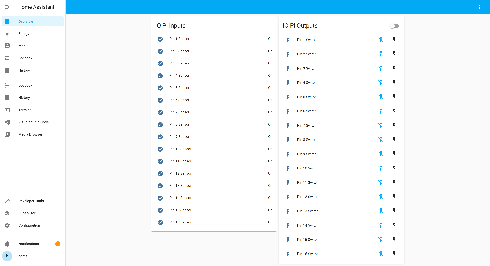

# Readme AB Electronics UK IOPi

[![Project Maintenance][maintenance-shield]][user_profile]

[![Community Forum][forum-shield]](https://www.abelectronics.co.uk/forums/)

This custom component is designed to run the [IO Pi Plus](https://www.abelectronics.co.uk/p/54/io-pi-plus) and [IO Pi Zero](https://www.abelectronics.co.uk/p/71/io-pi-zero) Raspberry Pi expansion boards from AB Electronics UK
 with Home Assistant smart home software from https://www.home-assistant.io/ on a Raspberry Pi computer.

The IO Pi boards use the Microchip MCP23017 IO expanders and this library is based on the Home Assistant MCP23017 integration modified to use our own IOPi Python library from https://www.abelectronics.co.uk/kb/article/23/python-library-and-demos


This component will enable the following platforms

| Platform     | Description                                                               |
| --------------- | ------------------------------------------------------------------------- |
| `binary_sensor` | Show pin status `True` or `False`.                                         |
| `switch`        | Switch pin status `True` or `False`.                                       |

## Requirements

This component requires the I2C bus on the Raspberry Pi to be enabled.

If you are using the Home Assistant Operating System you can’t use existing methods to enable the I2C bus on a Raspberry Pi, you will have to enable the I2C interface manually. Please follow the instruction on https://www.home-assistant.io/common-tasks/os#enable-i2c to enable I2C on your Home Assistant Operating System installation.

## Installation

1. Using your tool of choice, open the directory (folder) for your HA configuration (where you find `configuration.yaml`).
2. If you do not have a `custom_components` directory (folder) there, you need to create it.
3. In the `custom_components` directory (folder) create a new folder called `abelectronicsiopi`.
4. Download _all_ the files from the `custom_components/abelectronicsiopi/` directory (folder) in this repository.
5. Place the files you downloaded in the new directory (folder) you created.
6. Restart Home Assistant

Using your HA configuration directory (folder) as a starting point you should now also have this:

```text
custom_components/abelectronicsiopi/__init__.py
custom_components/abelectronicsiopi/binary_sensor.py
custom_components/abelectronicsiopi/IOPI.py
custom_components/abelectronicsiopi/manifest.json
custom_components/abelectronicsiopi/switch.py
```
## Example configuration.yaml

```yaml
binary_sensor:
  - platform: abelectronicsiopi
    i2c_address: 0x20
    scan_interval: 1
    invert_logic: false
    pull_mode: true
    pins:
      1: Pin 1 Sensor
      2: Pin 2 Sensor
      3: Pin 3 Sensor

switch:
  - platform: abelectronicsiopi
    i2c_address: 0x21
    invert_logic: false
    pins:
      1: Pin 1 Switch
      2: Pin 2 Switch
      3: Pin 3 Switch      
```
# Usage

## Binary Sensor Configuration Variables

The binary_sensor component uses the following variables to configure the sensor

Key | Type | Required | Description
-- | -- | -- | --
`i2c_address` | `Hex` | `True` | This contains the I2C address of the MCP23017 device. The default I2C addresses on the IO Pi Plus are 0x20 and 0x21.
`scan_interval` | `Integer` | `True` | This contains the scan interval in seconds between reading the device or pins in seconds.
`invert_logic` | `Boolean` | `False` | This boolean value (true / false) allows you to invert the polarity of the selected pin.
`pull_mode` | `Boolean` | `False` | This boolean value (true / false) enables or disables the internal 100K pull-up resistors for an individual pin.
`pins` | `Array` | `True` | This contains an array of the pins of the MCP23017 device numbered 1 to 16 with the pin number followed by the custom pin name.

## Editing the configuration.yaml file to add the binary sensor 

1. Using the text editor of choice open the `configuration.yaml` for your HA configuration.
2. Add a new `binary_sensor` with the following code: 
   ```yaml
    binary_sensor:
      - platform: abelectronicsiopi
    ```
3.  Add the following attributes to setup the component:
    ```yaml
    i2c_address: 0x20
    scan_interval: 1
    invert_logic: false
    pull_mode: true
    ```
3.  Add the pins array for the component:
    ```yaml
    pins:
      1: Pin 1 Sensor
      2: Pin 2 Sensor
      3: Pin 3 Sensor
      4: Pin 4 Sensor
      5: Pin 5 Sensor
      6: Pin 6 Sensor
      7: Pin 7 Sensor
      8: Pin 8 Sensor
      9: Pin 9 Sensor
      10: Pin 10 Sensor
      11: Pin 11 Sensor
      12: Pin 12 Sensor
      13: Pin 13 Sensor
      14: Pin 14 Sensor
      15: Pin 15 Sensor
      16: Pin 16 Sensor
    ```

The completed YMAL code should look like this:
```yaml
binary_sensor:
  - platform: abelectronicsiopi
    i2c_address: 0x20
    scan_interval: 1
    invert_logic: false
    pull_mode: true
    pins:
      1: Pin 1 Sensor
      2: Pin 2 Sensor
      3: Pin 3 Sensor
      4: Pin 4 Sensor
      5: Pin 5 Sensor
      6: Pin 6 Sensor
      7: Pin 7 Sensor
      8: Pin 8 Sensor
      9: Pin 9 Sensor
      10: Pin 10 Sensor
      11: Pin 11 Sensor
      12: Pin 12 Sensor
      13: Pin 13 Sensor
      14: Pin 14 Sensor
      15: Pin 15 Sensor
      16: Pin 16 Sensor
```

You can now add the sensor into the user interface.

***

## Switch Configuration Variables


The switch component uses the following variables to configure the switch

Key | Type | Required | Description
-- | -- | -- | --
`i2c_address` | `Hex` | `True` | This contains the I2C address of the MCP23017 device. The default I2C addresses on the IO Pi Plus are 0x20 and 0x21.
`invert_logic` | `Boolean` | `True` | This boolean value (true / false) allows you to invert the polarity of the selected pin.
`pins` | `Array` | `True` | This contains an array of the pins of the MCP23017 device numbered 1 to 16 with the pin number followed by the custom pin name.

## Editing the configuration.yaml file to add the switch

1. Using the text editor of choice open the `configuration.yaml` for your HA configuration.
2. Add a new `switch` with the following code: 
   ```yaml
    switch:
      - platform: abelectronicsiopi
    ```
3.  Add the following attributes to setup the component:
    ```yaml
    i2c_address: 0x21
    invert_logic: false
    ```
3.  Add the pins array for the component:
    ```yaml
    pins:
      1: Pin 1 Switch
      2: Pin 2 Switch
      3: Pin 3 Switch
      4: Pin 4 Switch
      5: Pin 5 Switch
      6: Pin 6 Switch
      7: Pin 7 Switch
      8: Pin 8 Switch
      9: Pin 9 Switch
      10: Pin 10 Switch
      11: Pin 11 Switch
      12: Pin 12 Switch
      13: Pin 13 Switch
      14: Pin 14 Switch
      15: Pin 15 Switch
      16: Pin 16 Switch
    ```

The completed YMAL code should look like this:
```yaml
switch:
  - platform: abelectronicsiopi
    i2c_address: 0x21
    invert_logic: false
    pins:
      1: Pin 1 Switch
      2: Pin 2 Switch
      3: Pin 3 Switch
      4: Pin 4 Switch
      5: Pin 5 Switch
      6: Pin 6 Switch
      7: Pin 7 Switch
      8: Pin 8 Switch
      9: Pin 9 Switch
      10: Pin 10 Switch
      11: Pin 11 Switch
      12: Pin 12 Switch
      13: Pin 13 Switch
      14: Pin 14 Switch
      15: Pin 15 Switch
      16: Pin 16 Switch
```

You can now add the sensors into the user interface.

## Demo UI Cards

```yaml
type: entities
entities:
  - entity: binary_sensor.pin_1_sensor
  - entity: binary_sensor.pin_2_sensor
  - entity: binary_sensor.pin_3_sensor
  - entity: binary_sensor.pin_4_sensor
  - entity: binary_sensor.pin_5_sensor
  - entity: binary_sensor.pin_6_sensor
  - entity: binary_sensor.pin_7_sensor
  - entity: binary_sensor.pin_8_sensor
  - entity: binary_sensor.pin_9_sensor
  - entity: binary_sensor.pin_10_sensor
  - entity: binary_sensor.pin_11_sensor
  - entity: binary_sensor.pin_12_sensor
  - entity: binary_sensor.pin_13_sensor
  - entity: binary_sensor.pin_14_sensor
  - entity: binary_sensor.pin_15_sensor
  - entity: binary_sensor.pin_16_sensor
title: IO Pi Inputs 

type: entities
entities:
  - entity: switch.pin_1_switch
  - entity: switch.pin_2_switch
  - entity: switch.pin_3_switch
  - entity: switch.pin_4_switch
  - entity: switch.pin_5_switch
  - entity: switch.pin_6_switch
  - entity: switch.pin_7_switch
  - entity: switch.pin_8_switch
  - entity: switch.pin_9_switch
  - entity: switch.pin_10_switch
  - entity: switch.pin_11_switch
  - entity: switch.pin_12_switch
  - entity: switch.pin_13_switch
  - entity: switch.pin_14_switch
  - entity: switch.pin_15_switch
  - entity: switch.pin_16_switch
title: IO Pi Outputs
```

Home Assistant screen showing 16 inputs and 16 outputs using an IO Pi Plus. 



---

[license-shield]: https://img.shields.io/github/license/abelectronicsuk/abelectronicsiopi.svg?style=for-the-badge
[maintenance-shield]: https://img.shields.io/badge/maintainer-%40abelectronicsuk-blue.svg?style=for-the-badge
[forum-shield]: https://img.shields.io/badge/community-forum-brightgreen.svg?style=for-the-badge
[user_profile]: https://github.com/abelectronicsuk

